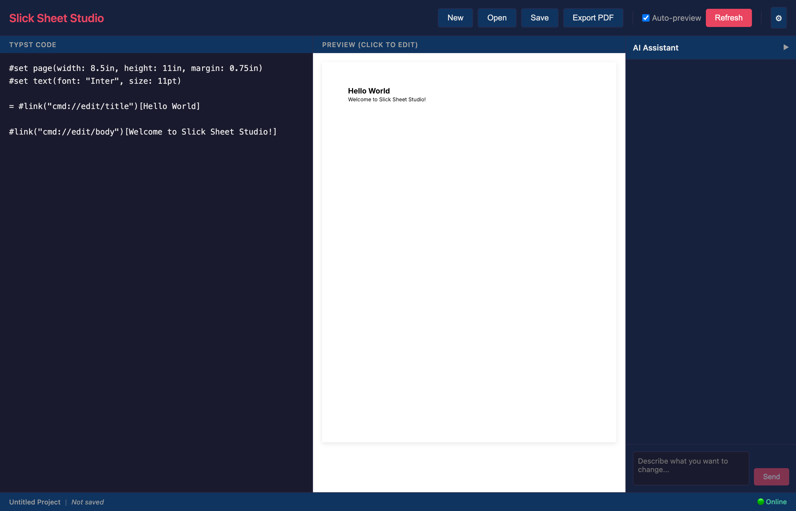
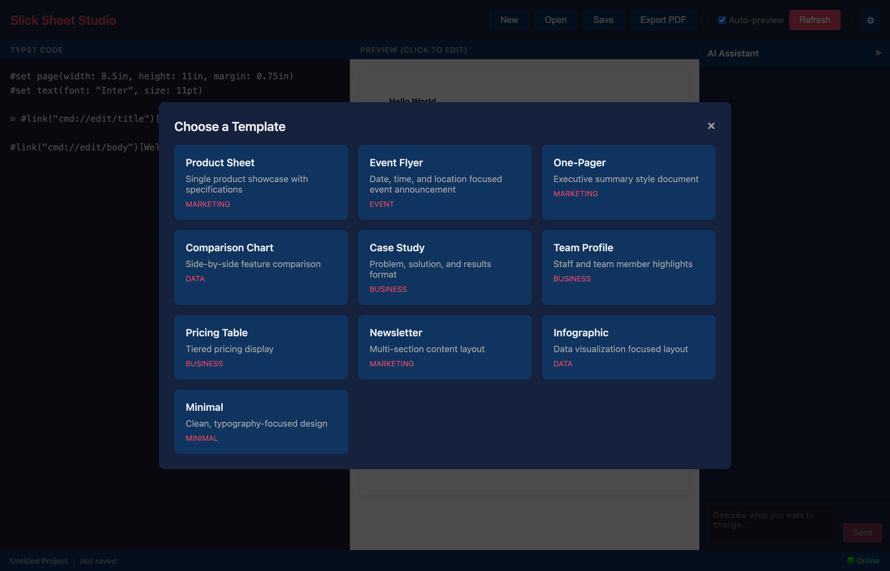
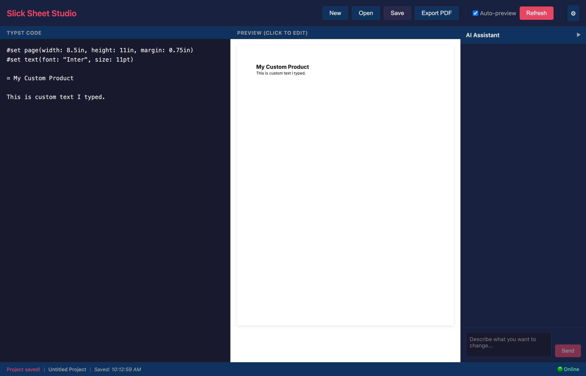
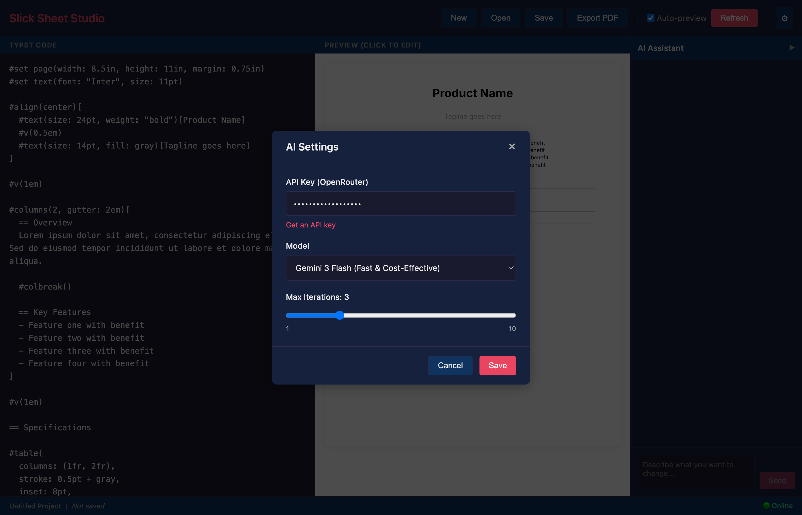
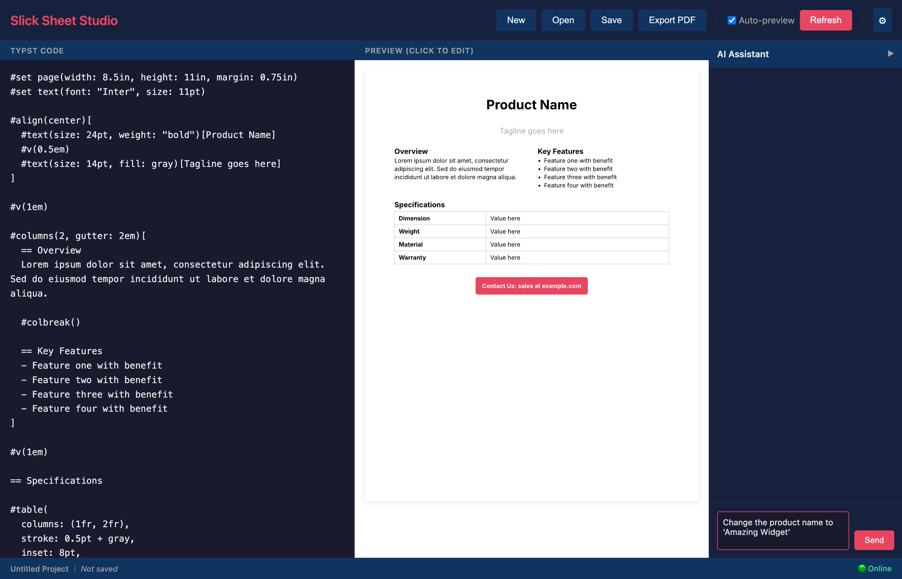
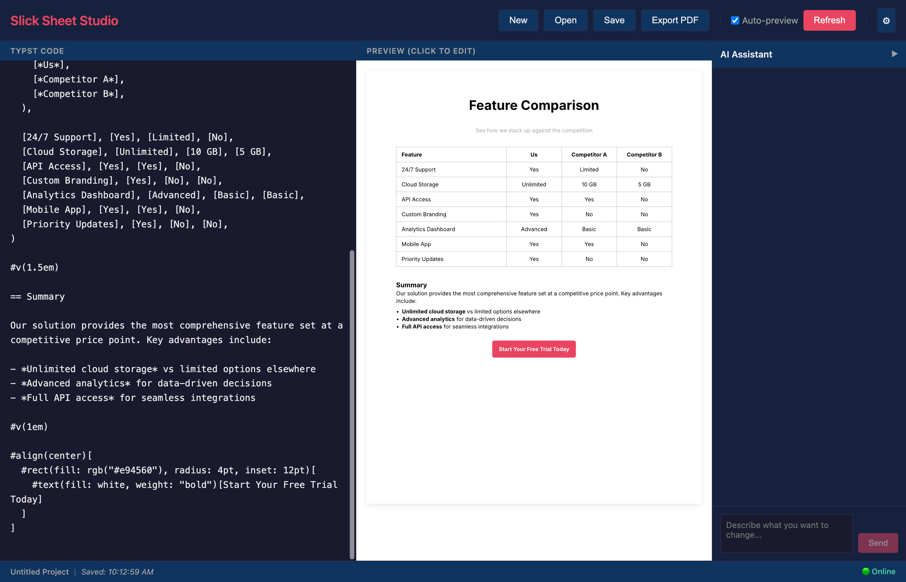
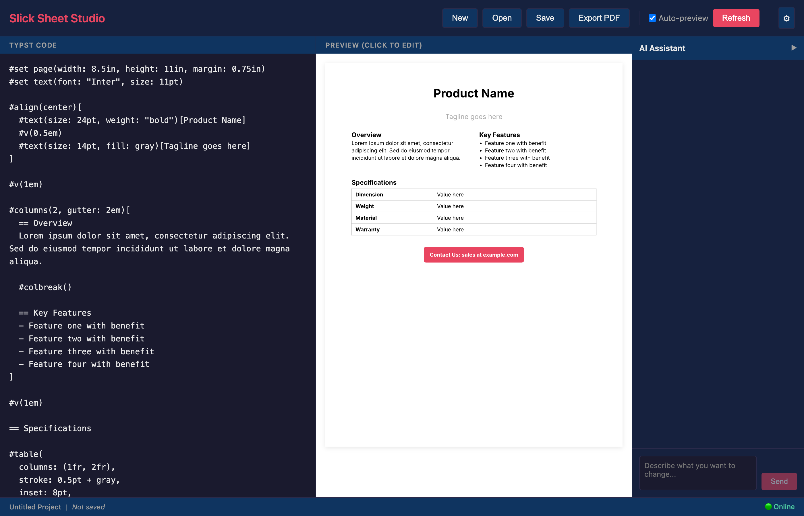
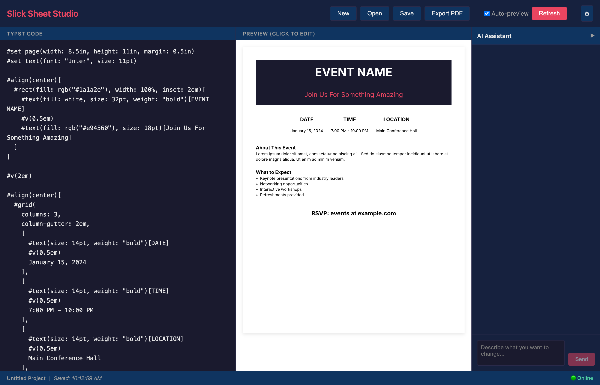
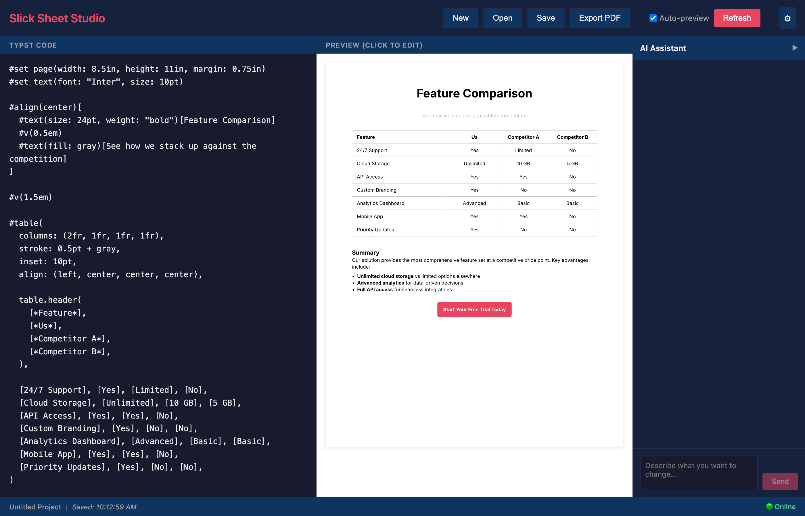

# Slick Sheet Studio - UI Browser Review

**Review Date:** January 15, 2026
**Reviewer:** Claude Code (Automated Browser Testing)
**Application URL:** http://localhost:8080

---

## Executive Summary

Slick Sheet Studio is a Rust/WASM-based application for creating marketing slick sheets using Typst markup with AI assistance. The UI is well-designed with a clean, dark theme and a three-panel layout. The core editing functionality works well, but there are some areas for improvement in terms of user feedback and interactive editing.

---

## 1. Complete UI Layout and Components

### 1.1 Header/Toolbar (Top Navigation)

The header contains the following elements from left to right:

| Element | Type | Description |
|---------|------|-------------|
| **Slick Sheet Studio** | Logo/Title | Application branding in coral/red color |
| **New** | Button | Opens template selection modal |
| **Open** | Button | Opens file picker (triggers native file dialog) |
| **Save** | Button | Saves project to browser storage |
| **Export PDF** | Button | Exports current document as PDF |
| **Auto-preview** | Checkbox | Toggles automatic preview updates on code changes |
| **Refresh** | Button (Red) | Manually refreshes the preview |
| **Settings (Gear)** | Button | Opens AI settings modal |

### 1.2 Main Content Area (Three-Panel Layout)

The main area is divided into three sections:

#### Left Panel: Typst Code Editor
- **Header:** "TYPST CODE"
- **Content:** Multi-line text area for Typst markup code
- **Features:**
  - Scrollable content
  - Supports all Typst syntax
  - Real-time updates when Auto-preview is enabled

#### Center Panel: Preview
- **Header:** "PREVIEW (CLICK TO EDIT)"
- **Content:** Rendered SVG preview of the document
- **Features:**
  - Shows real-time document preview
  - Scales to fit the available space
  - Displays Letter-size (8.5x11 inch) document format

#### Right Panel: AI Assistant
- **Header:** "AI Assistant" with collapse/expand toggle
- **Content:**
  - Chat input field with placeholder "Describe what you want to change..."
  - Send button (disabled when input is empty)
- **Features:**
  - Collapsible panel (toggle arrow changes direction)
  - Send button enables when text is entered

### 1.3 Status Bar (Footer)

The footer displays:
- Temporary status messages (e.g., "PDF exported!", "Project saved!")
- Project name ("Untitled Project")
- Save status ("Not saved" or "Saved: [timestamp]")
- Online status indicator (green dot with "Online")

---

## 2. Interactive Elements and Their Behavior

### 2.1 New Button

**Behavior:** Opens a modal titled "Choose a Template" with 10 template options:

| Template | Category | Description |
|----------|----------|-------------|
| Product Sheet | Marketing | Single product showcase with specifications |
| Event Flyer | Event | Date, time, and location focused event announcement |
| One-Pager | Marketing | Executive summary style document |
| Comparison Chart | Data | Side-by-side feature comparison |
| Case Study | Business | Problem, solution, and results format |
| Team Profile | Business | Staff and team member highlights |
| Pricing Table | Business | Tiered pricing display |
| Newsletter | Marketing | Multi-section content layout |
| Infographic | Data | Data visualization focused layout |
| Minimal | Minimal | Clean, typography-focused design |

Each template card shows:
- Template name (bold)
- Description
- Category tag (colored)

**Issue:** Modal can be closed via X button, but clicking outside the modal does not close it.

### 2.2 Open Button

**Behavior:** Shows "active" state briefly, triggers native file picker dialog.

**Note:** The native file picker is handled by the browser and cannot be captured in screenshots. The file format expected appears to be JSON project files.

### 2.3 Save Button

**Behavior:**
1. Saves project to browser storage (likely IndexedDB or localStorage)
2. Displays "Project saved!" message in status bar
3. Updates save timestamp in footer

### 2.4 Export PDF Button

**Behavior:**
1. Compiles current Typst code to PDF
2. Triggers browser download
3. Displays "PDF exported!" message in status bar

### 2.5 Auto-preview Checkbox

**Behavior:**
- **Checked (default):** Preview updates automatically as you type
- **Unchecked:** Preview only updates when Refresh button is clicked

### 2.6 Refresh Button

**Behavior:** Manually triggers preview compilation and update. Useful when Auto-preview is disabled.

### 2.7 Settings Button (Gear Icon)

**Behavior:** Opens "AI Settings" modal with the following options:

| Setting | Type | Description |
|---------|------|-------------|
| API Key (OpenRouter) | Password Input | API key for OpenRouter service |
| Get an API key | Link | Opens https://openrouter.ai/keys |
| Model | Dropdown | AI model selection |
| Max Iterations | Slider (1-10) | Maximum AI iteration attempts |

**Available Models:**
1. Gemini 3 Flash (Fast & Cost-Effective) - Default
2. Claude 4.5 Haiku (Balanced Quality)
3. GPT-5.2 Mini (Alternative)
4. Claude Sonnet 4 (Best Quality)

**Buttons:**
- Cancel: Closes modal without saving
- Save: Saves settings and closes modal

### 2.8 AI Assistant Panel

**Behavior:**
- **Collapsed State:** Shows "AI Assistant" header with expand arrow
- **Expanded State:** Shows header with collapse arrow plus input field
- **Input Field:** Text area for describing desired changes
- **Send Button:** Disabled when empty, enabled when text is entered

**Note:** The AI assistant requires a valid API key configured in settings to function.

### 2.9 Code Editor

**Behavior:**
- Editable text area for Typst markup
- Scrollable for long documents
- Supports standard text editing (select all, copy, paste)
- Changes trigger preview update if Auto-preview is enabled

### 2.10 Preview Panel

**Behavior:**
- Displays rendered document as SVG
- Header says "(click to edit)" but clicking doesn't show visible editing UI
- The initial template includes `cmd://edit/` links that appear in the ARIA tree but clicking them doesn't trigger visible actions

---

## 3. User Workflow

### 3.1 Creating a New Slick Sheet

1. **Start:** Click "New" button
2. **Select Template:** Choose from 10 template categories
3. **Edit Code:** Modify the Typst code in the left panel
4. **Preview:** View changes in real-time (if Auto-preview is on)
5. **Save:** Click "Save" to store the project
6. **Export:** Click "Export PDF" to download the finished document

### 3.2 Editing an Existing Project

1. Click "Open" button
2. Select a previously saved project file
3. Edit as needed
4. Save changes

### 3.3 Using AI Assistance

1. Configure API key in Settings
2. Type a description of desired changes in the AI Assistant panel
3. Click "Send" to submit the request
4. AI modifies the code and updates the preview

---

## 4. Template Examples

### 4.1 Product Sheet Template

Features:
- Centered product name and tagline
- Two-column layout (Overview + Key Features)
- Specifications table
- Contact CTA button

### 4.2 Event Flyer Template

Features:
- Bold header with colored background
- Date/Time/Location grid
- Event description section
- What to Expect bullet list
- RSVP information

### 4.3 Comparison Chart Template

Features:
- Feature comparison table (4 columns)
- Summary section with key advantages
- CTA button

---

## 5. UI Bugs, Missing Features, and Usability Issues

### 5.1 Bugs

| Issue | Severity | Description |
|-------|----------|-------------|
| Click-to-edit not working | Medium | Preview panel header says "(click to edit)" but clicking on the preview doesn't show any editing interface |
| Links in SVG may not be clickable | Low | The `cmd://edit/` links visible in ARIA tree don't seem to trigger visible actions |

### 5.2 Missing Features

| Feature | Priority | Description |
|---------|----------|-------------|
| Undo/Redo | High | No visible undo/redo buttons or keyboard shortcut feedback |
| Syntax highlighting | Medium | Code editor lacks syntax highlighting for Typst |
| Line numbers | Medium | No line numbers in the code editor |
| Error messages | High | No visible error display when Typst code has syntax errors |
| Project naming | Medium | Cannot rename "Untitled Project" from the UI |
| Multiple pages | Low | No page navigation for multi-page documents |
| Zoom controls | Low | No zoom in/out for the preview |
| Dark/Light theme toggle | Low | Only dark theme available |

### 5.3 Usability Issues

| Issue | Impact | Recommendation |
|-------|--------|----------------|
| No code formatting | Medium | Add "Format Code" button or auto-formatting |
| Modal escape | Low | Allow clicking outside modal to close it |
| No keyboard shortcuts | Medium | Add Cmd+S for save, Cmd+E for export, etc. |
| No progress indicator for AI | Medium | Show loading state when AI is processing |
| No preview scaling | Low | Add zoom controls for preview panel |
| No code search | Low | Add find/replace functionality |

### 5.4 Accessibility

- ARIA labels are present for most elements
- Keyboard navigation appears functional
- Color contrast in dark theme is adequate
- Checkbox and buttons have appropriate roles

---

## 6. Screenshots Summary

| Screenshot | Description |
|------------|-------------|
| `01_initial_state.png` | Initial app state with default "Hello World" template |
| `02_after_new_click.png` | Template selection modal |
| `03_product_sheet_template.png` | Product Sheet template loaded |
| `04_clicked_preview.png` | State after clicking preview |
| `05_open_dialog.png` | After clicking Open button |
| `06_settings.png` | AI Settings modal |
| `07_ai_panel_toggled.png` | AI panel collapsed |
| `08_ai_panel_expanded.png` | AI panel expanded |
| `09_ai_input_typed.png` | AI input with text entered |
| `10_custom_code.png` | Custom code typed in editor |
| `11_export_pdf.png` | After Export PDF click |
| `12_save.png` | After Save click |
| `13_auto_preview_off.png` | Auto-preview unchecked |
| `14_template_modal.png` | Template modal visible |
| `15_event_flyer.png` | Event Flyer template |
| `16_comparison_chart.png` | Comparison Chart template |
| `17_after_refresh.png` | After Refresh button click |
| `18_full_page.png` | Full page screenshot |
| `19_settings_again.png` | Settings modal (second view) |
| `20_model_dropdown.png` | Model dropdown in settings |
| `21_code_scrolled.png` | Code editor scrolled to bottom |

---

## 7. Recommendations

### High Priority
1. Add error display for invalid Typst code
2. Implement undo/redo functionality
3. Add loading indicators for async operations

### Medium Priority
1. Add syntax highlighting to code editor
2. Add line numbers to code editor
3. Implement keyboard shortcuts
4. Add project renaming capability

### Low Priority
1. Add zoom controls for preview
2. Add dark/light theme toggle
3. Add code find/replace functionality
4. Allow modal dismissal by clicking outside

---

## 8. Conclusion

Slick Sheet Studio provides a functional and visually appealing interface for creating marketing documents with Typst. The template system is comprehensive, the preview functionality works well, and the AI integration shows promise. The main areas for improvement are:

1. **Error handling** - Users need feedback when code has errors
2. **Editor enhancements** - Syntax highlighting and line numbers would significantly improve the editing experience
3. **Click-to-edit functionality** - The promised "click to edit" feature in the preview panel appears to be non-functional

Overall, the application is in a usable state for creating basic slick sheets, with room for polish and feature additions.
